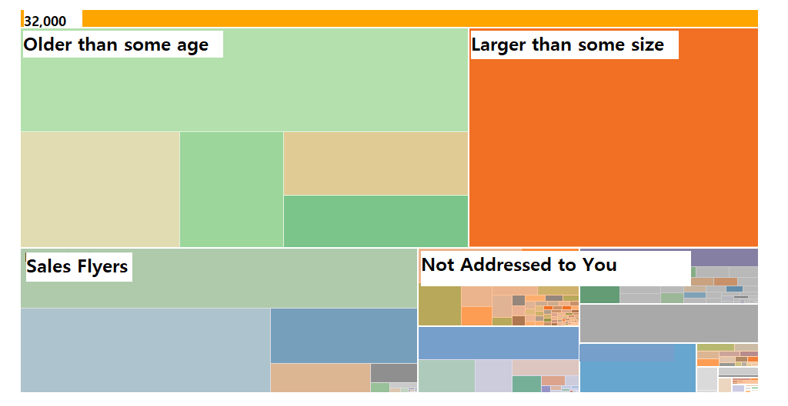

# Email Client for Organizing Inboxes

## The problem

There are two types of people in this world, those with 0 unread emails in their inbox, and those with 32,000+.
Once an inbox has been flooded by thousands of emails, it is nearly impossible to sift through the mess and reclaim it.

## Key features

- Zoomable treemap of emails according to their categorization and senders.
- Bulk selection and actions for groups of emails (delete, mark as read, etc.)
- Unsubscribe to groups of emails automatically (similar to [unroll me](https://unroll.me/)).
- Similar features as [clean email](https://clean.email/), so we would need to think of additional features, or refocus it.

## Who would buy it

My initial assumption of why [clean email](https://clean.email/) isn't incredibly popular is that the people who need this app have learned to live with a messy inbox, and are not seeking for a solution to this problem. So perhaps this is not the most marketable idea.